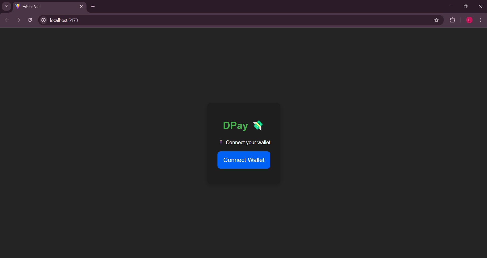
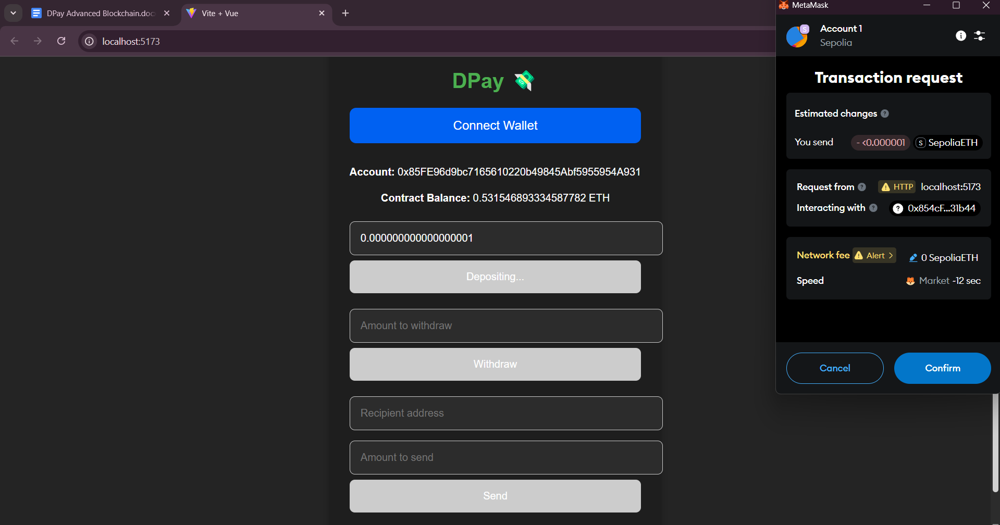
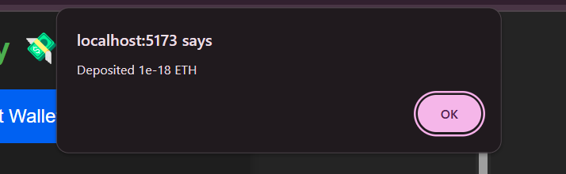
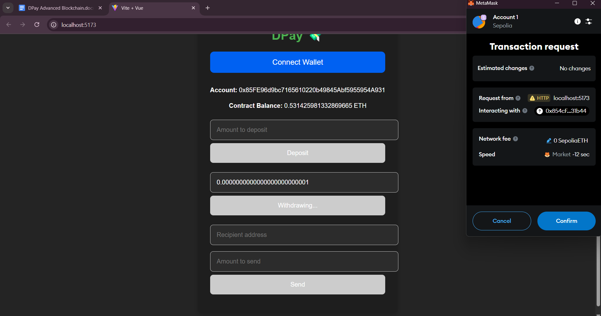
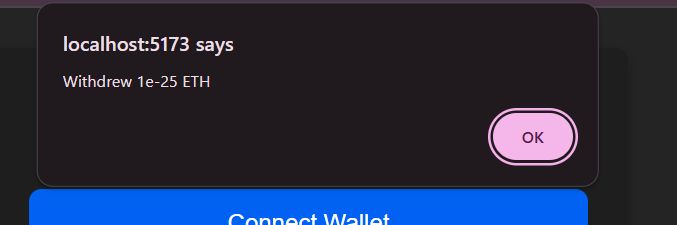
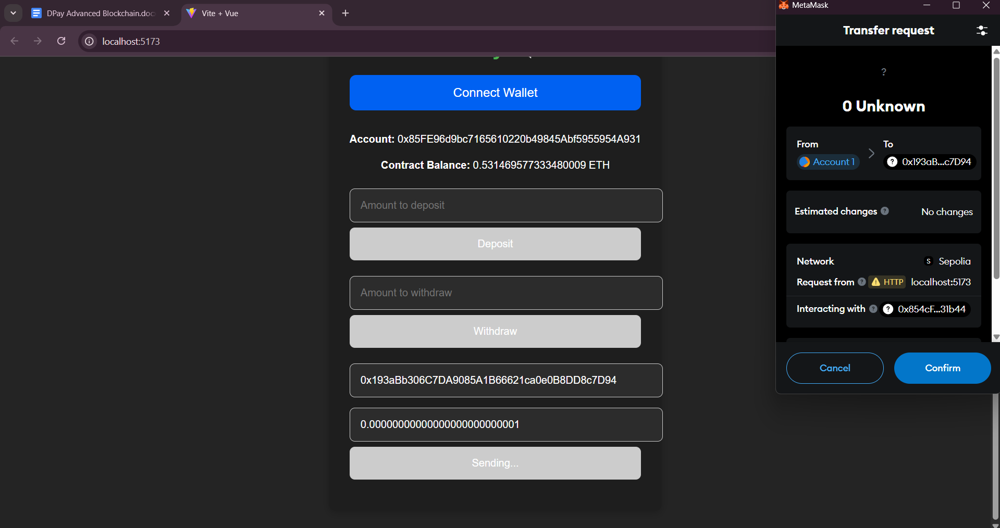
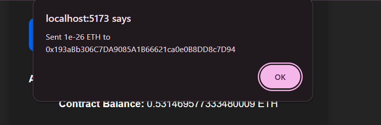

# DPay – Decentralized Wallet DApp

## Overview

**DPay** is a decentralized wallet application that allows users to deposit, withdraw, and transfer Ether via a secure, blockchain-backed interface. It integrates a Solidity smart contract deployed to the Sepolia Testnet with a Vue.js frontend, offering a GPay-style user experience for Ethereum transactions. The DApp is connected to MetaMask and uses Ethers.js for Web3 interaction.

---

## Features

- Deposit and withdraw ETH from the contract (owner-only)
- Transfer ETH to other addresses
- View contract balance and connected wallet address
- MetaMask integration and Sepolia Testnet support
- Real-time UI feedback on transaction status

---

## Prerequisites

- Node.js ≥ 16
- npm or yarn
- MetaMask Extension
- Sepolia Testnet ETH (via [Sepolia Faucet](https://sepoliafaucet.com))
- Hardhat (local or globally installed)

---

## Backend (Smart Contract)

### 1. Install Dependencies

```bash
cd backend
npm install
```

### 2. Compile Smart Contract

```bash
npx hardhat compile
```

### 3. Deploy Contract to Sepolia Testnet

Create a `.env` file under backend
Update your `.env` file with the following:

```
PRIVATE_KEY=your_wallet_private_key
SEPOLIA_RPC_URL=https://sepolia.infura.io/v3/YOUR_INFURA_KEY
```

Then deploy:

```bash
npx hardhat run scripts/deploy.js --network sepolia
```

Copy the deployed contract address and paste it into the frontend integration as needed (WalletApp.Vue).

---

## Frontend (Vue.js + Ethers.js)

### 1. Install Frontend Dependencies

```bash
cd frontend
npm install
```

### 2. Run the Frontend App

```bash
npm run dev
```

The app will be available at: `http://localhost:5173`

---

## App Preview:

Below are screenshots of the DPay Wallet DApp in action:

### Dashboard View

<div align="center">
  
</div>

### Deposit ETH

<div style="display: flex; justify-content: center; gap: 20px;">
  
  
</div>

### Withdraw ETH

<div style="display: flex; justify-content: center; gap: 20px;">
  
  
</div>

### Send ETH to Another Address

<div style="display: flex; justify-content: center; gap: 20px;">
  
  
</div>

---

## MetaMask Configuration

1. Add the **Sepolia** network manually (if not already present).
2. Import the account using the same private key used during deployment.
3. Connect your wallet on app load when prompted.
4. Use Sepolia ETH for test transactions.

---

## Smart Contract Summary

**DPay.sol** includes:

- `deposit()` – Add funds to the wallet (owner-only or fallback)
- `withdraw(uint256 amount)` – Withdraw funds from the contract
- `transfer(address to, uint256 amount)` – Transfer ETH to any address
- `getBalance()` – View the contract’s ETH balance
- `owner()` – Get the owner address
- `events` – Emit logs for Deposit, Withdraw, and Transfer actions
